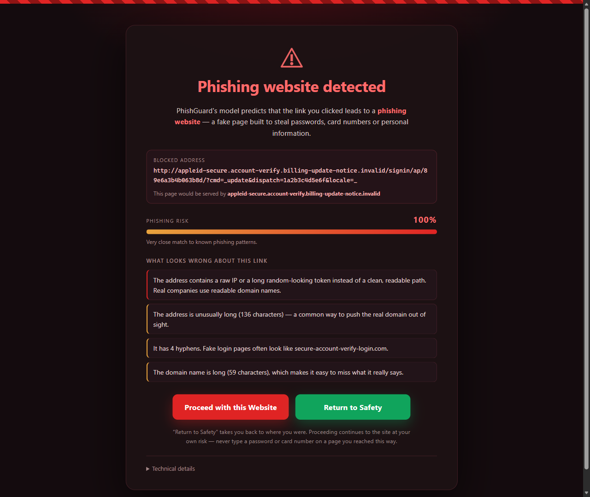
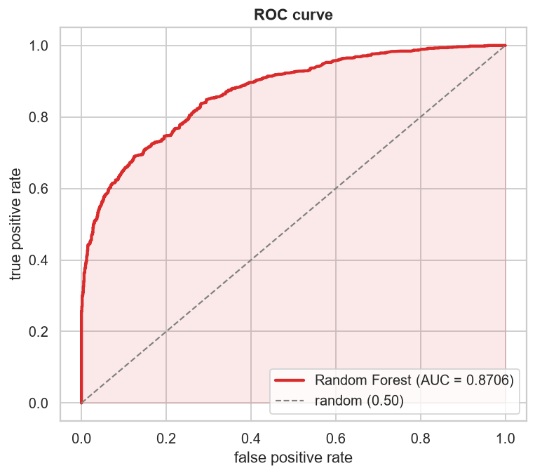
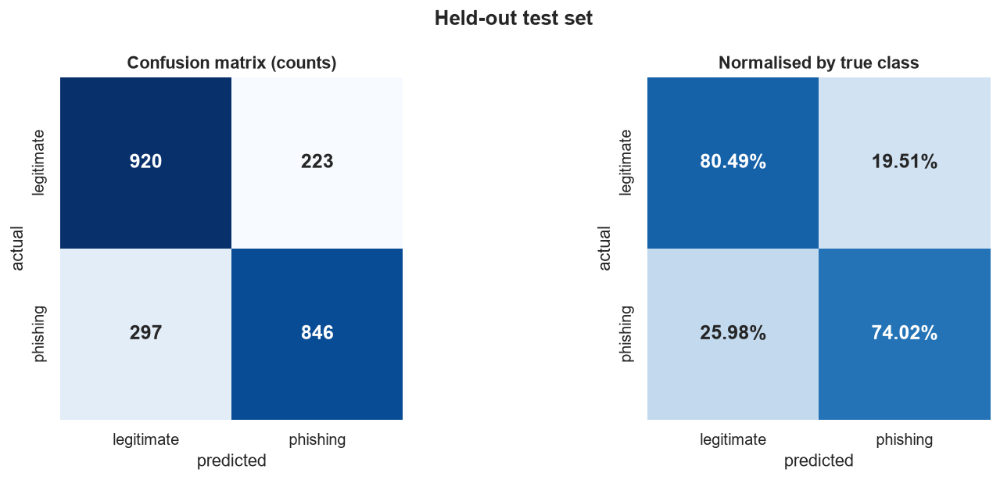
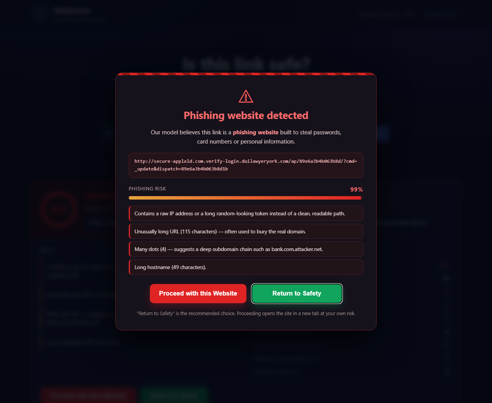

# PhishGuard — AI Phishing Website Detection

A machine-learning system that warns you **before** you open a phishing site.
It ships as two things that share one model:

* a **web app** where you paste a link and get a verdict, and
* a **Chrome/Edge extension** that scores every link you click and interrupts
  the navigation with a full-page warning offering two choices —
  <kbd>Proceed with this Website</kbd> (red) and <kbd>Return to Safety</kbd> (green).

Everything the extension does happens on your own machine. The model is
compiled into a 253 KB JSON file that ships inside the extension, so no URL,
page or browsing history is ever uploaded.

<p align="center">
  
</p>

---

## Contents

| Path | What it is |
| --- | --- |
| [`ml/`](ml/) | Feature extraction, training, evaluation, model export, parity checks |
| [`webapp/`](webapp/) | Flask app: the URL scanner UI, the evaluation report, and the JSON API |
| [`extension/`](extension/) | Manifest V3 browser extension |
| [`reports/`](reports/) | Generated metrics and all ten figures |
| [`tests/`](tests/) | API tests (Python) and extension-logic tests (Node) |
| [`data/`](data/) | `dataset_phishing.csv` — 11,430 labelled URLs |

---

## Quick start

```bash
pip install -r requirements.txt

python run.py all      # train -> evaluate -> export -> verify -> test
python run.py web      # http://127.0.0.1:5000
```

Then load the extension:

1. Open `chrome://extensions` (or `edge://extensions`).
2. Turn on **Developer mode**.
3. Click **Load unpacked** and select the [`extension/`](extension/) folder.

The extension works immediately and needs no server — the web app is optional.

Individual steps are also available: `python run.py train | evaluate | export |
verify | test | web`.

---

## The model

### Features

Trained on exactly the ten requested columns of `dataset_phishing.csv`. `url` is
the identifier; the other nine are the model inputs:

| Feature | Meaning |
| --- | --- |
| `length_url` | Total number of characters in the address |
| `length_hostname` | Length of the hostname, excluding any port |
| `ip` | 1 when the URL embeds a raw IPv4 address or a long (7+) hex token |
| `nb_dots` | Count of `.` |
| `nb_hyphens` | Count of `-` |
| `nb_at` | Count of `@` |
| `nb_qm` | Count of `?` |
| `nb_and` | Count of `&` |
| `nb_or` | Count of `\|` |

`nb_or` is **0 for every row in this dataset**, so it contributes nothing. It is
kept because it was part of the requested feature set, and
[`ml/train_model.py`](ml/train_model.py) reports this explicitly rather than
silently dropping it.

### Reproducing the dataset's definitions

The web app and the extension have to compute these nine numbers from a raw URL,
while the model was trained on the columns already in the CSV. If the two
disagreed, live predictions would be quietly wrong.

[`ml/verify_features.py`](ml/verify_features.py) checks the extractor against
all 11,430 rows:

```
feature              agreement   mismatches
-------------------------------------------
length_url           99.9475%            6
length_hostname     100.0000%            0
ip                  100.0000%            0
nb_dots              99.9913%            1
nb_hyphens          100.0000%            0
nb_at                100.0000%           0
nb_qm                100.0000%           0
nb_and               100.0000%           0
nb_or                100.0000%           0
```

The seven remaining mismatches are URLs that were truncated when the CSV was
written, not extraction bugs.

The `ip` column needed reverse-engineering: it is **not** "the hostname is an IP
address" (only 97 rows match that, against 1,721 positives). It fires on a raw
IPv4 address followed by `/`, **or** on any run of 7 or more hexadecimal
characters — the long random resource ids typical of phishing kits. That rule
reproduces the column on 11,430 of 11,430 rows.

### Model selection

Eight candidates, 5-fold stratified cross-validation on the training split:

| Model | ROC-AUC | Accuracy | Precision | Recall | F1 |
| --- | --- | --- | --- | --- | --- |
| **Random Forest** | **0.8653** | 0.7744 | 0.7973 | 0.7364 | 0.7655 |
| Extra Trees | 0.8616 | 0.7729 | 0.8231 | 0.6958 | 0.7539 |
| Gradient Boosting | 0.8585 | 0.7651 | 0.8004 | 0.7073 | 0.7509 |
| K-Nearest Neighbors | 0.8300 | 0.7687 | 0.7925 | 0.7286 | 0.7591 |
| Decision Tree | 0.8277 | 0.7406 | 0.7883 | 0.6608 | 0.7177 |
| SVM (RBF) | 0.8275 | 0.7420 | 0.8148 | 0.6264 | 0.7082 |
| Gaussian Naive Bayes | 0.7900 | 0.6307 | 0.9391 | 0.2795 | 0.4308 |
| Logistic Regression | 0.7658 | 0.6990 | 0.7535 | 0.5927 | 0.6633 |

**Random Forest** wins and serves the web app API.

### Held-out test results

2,286 URLs the model never saw, at the default 0.50 threshold:

| Metric | Value |
| --- | --- |
| ROC-AUC | **0.8706** |
| Average precision | 0.8865 |
| Accuracy | 0.7725 |
| Precision | 0.7914 |
| Recall | 0.7402 |
| F1 | 0.7649 |
| Matthews correlation | 0.5462 |
| Specificity | 0.8049 |
| False positive rate | 0.1951 |

<p align="center">
  
  
</p>

All ten figures are in [`reports/figures/`](reports/figures/) and are rendered
together at `/report` in the running web app:

| | |
| --- | --- |
| `01_class_distribution.png` | Balance of the two classes |
| `02_feature_distributions.png` | Each feature, phishing vs legitimate |
| `03_correlation_heatmap.png` | Feature correlations and correlation with the label |
| `04_model_comparison.png` | All eight models across all metrics |
| `05_confusion_matrix.png` | Counts and per-class percentages |
| `06_roc_curve.png` | ROC with AUC |
| `07_precision_recall_curve.png` | Precision-recall with average precision |
| `08_feature_importance.png` | Impurity-based and permutation importance |
| `09_learning_curve.png` | Does more data help? |
| `10_threshold_analysis.png` | How the four metrics move with the threshold |

---

## What this model can and cannot do

Nine lexical features are a genuinely useful signal, and they are cheap enough
to run on every navigation without touching the network. They are also all this
model gets — it never sees the page, its certificate, its age, or its content.

That has a concrete consequence: **at the 0.50 threshold the model raises a
false alarm on about one legitimate URL in five.** A long, parameter-heavy URL
on a site you trust looks, structurally, a lot like a phishing URL. Left
unhandled, that would make the extension unusable, and an ignored security
warning is worse than none.

Two deliberate design choices address this:

1. **The extension blocks at 0.70, not 0.50.** At that threshold precision is
   ~93% and recall ~55% (see `reports/metrics/threshold_sweep.csv`). Fewer
   catches, far fewer interruptions on real sites. The slider in the popup lets
   you move it between 0.30 and 0.90.
2. **Well-known domains are never interrupted.**
   [`extension/lib/allowlist.js`](extension/lib/allowlist.js) carries ~230 major
   domains, and you can add your own from the popup. This is what production
   phishing blockers do, and without it the extension would interrupt on sites
   like `stackoverflow.com/questions/tagged/python`.

Both are switchable in Options. Treat a warning as a reason to read the address
bar carefully — not as proof.

---

## The extension

```
extension/
├── manifest.json          Manifest V3
├── background.js          service worker: scores navigations, shows the warning
├── content.js/.css        scores links in the page, intercepts risky clicks
├── warning.html/.css/.js  the full-page interstitial (the two buttons)
├── popup.html/.css/.js    toolbar popup: current page score, sensitivity slider
├── options.html/.css/.js  settings, trusted sites, optional API
├── safe.html              landing page when there is nowhere to go back to
└── lib/
    ├── features.js        JavaScript mirror of ml/features.py
    ├── model.js           ~30-line scorer for the exported model
    ├── model.json         the trained model (300 trees, 253 KB)
    └── allowlist.js       well-known domains
```

### How a click is handled

1. When a page settles, the content script sends every link on it to the service
   worker, which scores them all locally.
2. Clicking a link the model flagged is intercepted **before** navigation and an
   in-page modal appears with the two buttons.
3. Anything the content script misses — typed addresses, redirects, new tabs —
   is caught by `webNavigation.onBeforeNavigate`, which redirects the tab to the
   full-page warning.
4. **Return to Safety** goes back to the previous page (or to `safe.html` if
   the tab has no history). **Proceed with this Website** asks for a second
   confirmation, then adds the URL to a session-scoped bypass list and continues.

### Two models, one behaviour

The web app serves the Random Forest (0.8706 test ROC-AUC). A Random Forest is
too large to embed in an extension, so the extension ships the Gradient Boosting
model (0.8585 CV ROC-AUC) exported to JSON.

Two checks keep the extension honest:

* [`ml/export_js_model.py`](ml/export_js_model.py) refuses to write the export
  unless it reproduces scikit-learn's `predict_proba` on the whole test set to
  within 1e-9 (actual: **2.6e-13**).
* [`ml/parity_check.py`](ml/parity_check.py) runs the extension's real
  JavaScript under Node over 1,500 dataset URLs and compares every feature and
  probability against Python. Current result: **0 feature mismatches, max
  probability delta 3.0e-13**.

Optionally, Options can point the extension at a running web app for a second
opinion from the Random Forest. It is **off by default**, because turning it on
means sending the URLs you visit to that server.

---

## The web app

<p align="center">
  
</p>

| Route | Purpose |
| --- | --- |
| `GET /` | URL scanner. `/?url=…` scans on load, so scans are shareable |
| `GET /report` | The full evaluation report with every figure |
| `POST /api/predict` | `{"url": "...", "threshold": 0.5}` → verdict |
| `POST /api/predict/batch` | `{"urls": [...]}` → up to 100 verdicts |
| `GET /api/model-info` | Model card and test metrics |
| `GET /api/health` | Liveness probe |

```bash
curl -X POST http://127.0.0.1:5000/api/predict \
     -H "Content-Type: application/json" \
     -d '{"url":"http://secure-appleld.com.verify-login.example.com/ap/89e6a3b4b063b8d/?cmd=_update"}'
```

```json
{
  "verdict": "phishing",
  "probability": 0.9872,
  "risk_score": 99,
  "risk_level": "high",
  "hostname": "secure-appleld.com.verify-login.example.com",
  "features": { "length_url": 115, "ip": 1, "nb_dots": 4, "...": "..." },
  "reasons": [{ "level": "bad", "text": "Contains a raw IP address or a long random-looking token…" }]
}
```

---

## Tests

```bash
python run.py test
```

* `tests/test_api.py` — 27 checks: routes, prediction, thresholds, batch,
  input validation.
* `tests/test_extension.js` — 26 checks: feature extraction against known
  dataset rows, scoring, the allowlist, and accuracy on a dataset sample.
* `ml/parity_check.py` — Python ↔ JavaScript agreement.

All 53 checks currently pass.

### Verified in a real browser

The extension was also driven end to end in a live Chromium browser over the
DevTools protocol, with these results:

| Check | Result |
| --- | --- |
| Service worker boots and loads `model.json` | yes, 0 errors |
| Scores a known phishing URL | 0.9943, flagged |
| Marks risky links on a page, leaves safe ones alone | 2 of 4 links marked, correctly |
| Clicking a flagged link shows the modal and cancels navigation | yes, URL unchanged |
| Navigating to a phishing URL is intercepted | lands on the warning page |
| Warning page renders both buttons, green focused by default | yes |
| **Return to Safety** returns to the previous page | yes |
| **Proceed with this Website** continues and records the override | yes |
| The bypass persists, so the same URL is not blocked twice | yes |

Note: recent Google Chrome builds refuse `--load-extension` from the command
line, so that automated pass runs under Edge. Loading the folder by hand through
`chrome://extensions` → Developer mode → Load unpacked is unaffected and works
in both browsers.

---

## Project layout

```
Phishing_Detection_Project/
├── run.py                     task runner
├── requirements.txt
├── data/dataset_phishing.csv
├── ml/
│   ├── features.py            canonical feature extractor
│   ├── verify_features.py     extractor vs dataset columns
│   ├── train_model.py         trains and compares 8 models
│   ├── evaluate.py            metrics + 10 figures
│   ├── export_js_model.py     model -> JSON for the extension
│   └── parity_check.py        Python vs JavaScript
├── models/                    trained models + metadata
├── reports/figures/           10 PNGs
├── reports/metrics/           JSON / CSV / TXT results
├── webapp/                    Flask app
├── extension/                 Manifest V3 extension
├── tests/
└── docs/screenshots/
```

---

## Dataset

`data/dataset_phishing.csv` — 11,430 URLs, exactly balanced (5,715 phishing /
5,715 legitimate). The file carries 87 features in total; this project uses only
the ten specified above.

---

## License

[MIT](LICENSE)
